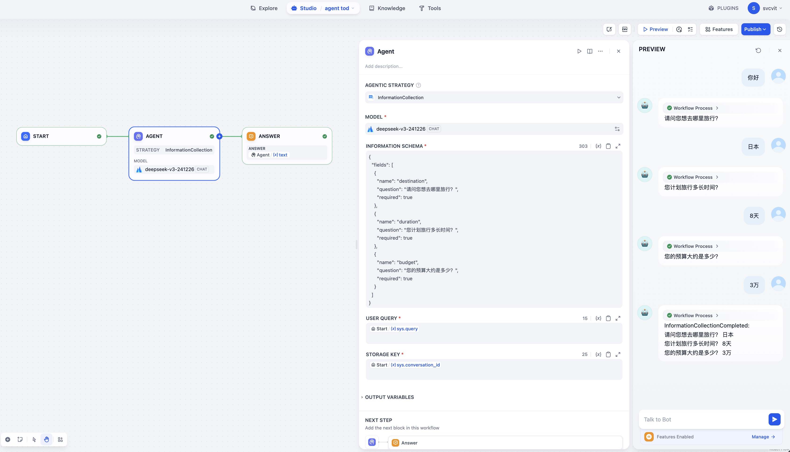
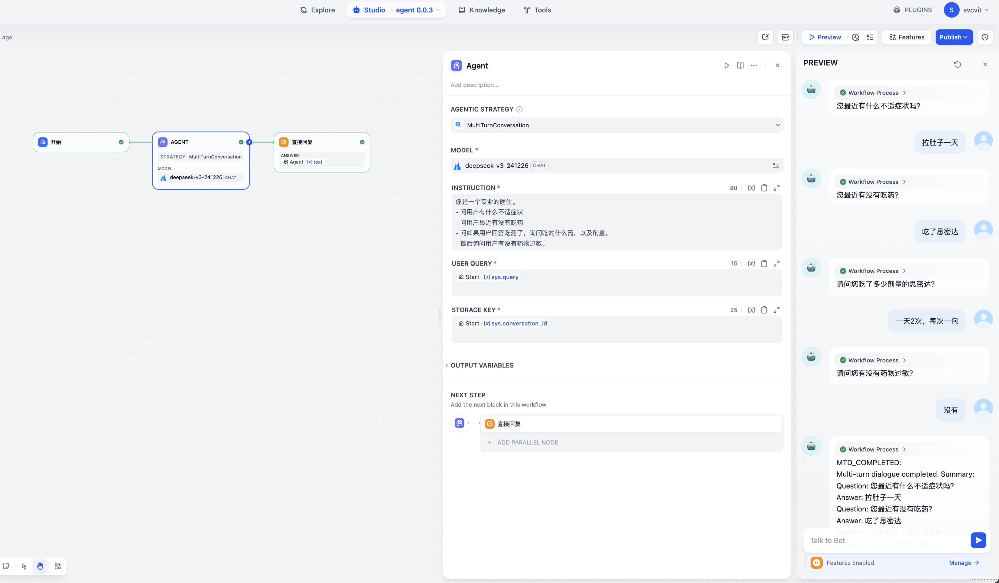

# Dialogue Agent

**Author:** [svcvit](https://github.com/svcvit)
**Repository:** [dify-plugin-tod_agent](https://github.com/svcvit/dify-plugin-tod_agent)
**Version:** 0.0.4

### Description





A powerful task-oriented dialogue agent that can collect information through structured conversations. It supports dynamic field validation, multi-field information extraction, and state management. The agent now includes two dialogue strategies: TOD (Task-Oriented Dialogue) for information collection and MTD (Multi-Turn Dialogue) for general conversations.

### Features

- Task-oriented dialogue management
- Dynamic field validation
- Multi-field information extraction
- Conversation state persistence
- Automatic answer validation
- Context-aware information collection
- Natural language interaction
- Multiple dialogue strategies support (TOD & MTD)

### Usage Guide

#### Dialogue Strategies

The agent supports two dialogue strategies:

1. **TOD (Task-Oriented Dialogue)**
   - A dialogue strategy for structured information collection
   - Suitable for form filling and information gathering scenarios
   - Supports dynamic field validation and state management

2. **MTD (Multi-Turn Dialogue)**
   - A strategy for general multi-turn conversations
   - Supports context awareness
   - Suitable for open-ended dialogue scenarios

#### TOD Strategy Parameters

1. **information_schema** (Required)
   - Type: string (JSON)
   - Description: Schema defining the fields to collect
   - Example:
     ```json
     {
       "fields": [
         {
           "name": "destination",
           "question": "请问您想去哪里旅行？",
           "required": true
         },
         {
           "name": "duration",
           "question": "您计划旅行多长时间？",
           "required": true
         },
         {
           "name": "budget",
           "question": "您的预算大约是多少？",
           "required": true
         }
       ]
     }
     ```

2. **query** (Required)
   - Type: string
   - Description: User's input text

3. **model** (Required)
   - Type: AgentModelConfig
   - Description: LLM model configuration
   - Example: Configuration for GPT or other LLM models

4. **storage_key** (Required)
   - Type: string
   - Description: Unique key for storing conversation state
   - Example: `"conversation-123"`

#### MTD Strategy Parameters

1. **instruction** (Required)
   - Type: string
   - Description: Dialogue instruction or system prompt
   - Example: 
     ```
      你是一个专业的医生。
      - 问用户有什么不适症状
      - 问用户最近有没有吃药
      - 问如果用户回答吃药了，询问吃的什么药，以及剂量。
      - 最后询问用户有没有药物过敏。
      - 最后询问用户有没有其他症状。
     ```

2. **query** (Required)
   - Type: string
   - Description: User's input text

3. **model** (Required)
   - Type: AgentModelConfig
   - Description: LLM model configuration
   - Example: Configuration for GPT or other LLM models

4. **storage_key** (Required)
   - Type: string
   - Description: Unique key for storing conversation state
   - Example: `"mtd-conversation-123"`

### Changelog

#### v0.0.4
- Updated dify_plugin dependency requirement to `>=0.1.0,<0.2.0`

#### v0.0.3
- Added MTD (Multi-Turn Dialogue) strategy support
- Fixed data type validation bugs
- Added support for schema JSON without leading spaces (compatible with Dify official update)
  
#### v0.0.2
- Added logging functionality
- Added token usage statistics
- Optimized code structure and performance

#### v0.0.1
- Project initialization
- Implemented multi-turn dialogue
- Implemented conversation state storage
- Implemented intelligent Q&A content extraction